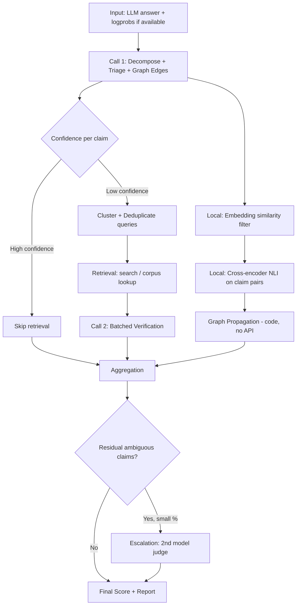

# PRD: Meta-LLM Hallucination Detection Engine
### Claim Graph Decomposition with Bounded-Cost Verification

**Status:** Draft v1
**Owner:** _TBD_
**Last updated:** 2026-08-23

---

## 1. Summary

A verifier system that takes an LLM-generated answer and outputs a factual confidence score, broken down per claim, with an auditable trail of evidence. The core design constraint: **total LLM API calls are fixed at 2 per answer** (plus rare, bounded escalation), regardless of how many claims the answer contains. Cost that the naive approach spends on LLM calls is pushed onto local models (embeddings, NLI) and free signals (token logprobs) instead.

---

## 2. Problem Statement

LLMs generate factually incorrect content with the same fluency and confidence as correct content. Downstream systems (agents, RAG pipelines, user-facing chat) have no native signal for "this specific sentence is unreliable." Existing fact-checking approaches (FActScore, SAFE, FacTool) solve the accuracy problem but scale LLM calls linearly or quadratically with claim count, making them too expensive for production use at scale.

**This system's bet:** most of the accuracy in these pipelines comes from decomposition quality and evidence retrieval, not from repeatedly re-asking an LLM to judge the same thing. Call budget can be fixed without sacrificing accuracy by moving judgment work to cheaper, purpose-built components (local NLI, embeddings) and only escalating to a second LLM call for the residual ambiguous cases.

---

## 3. Goals

- **G1:** Given any LLM-generated answer, produce a claim-level factuality report (supported / refuted / insufficient evidence) plus an aggregate confidence score in [0, 1].
- **G2:** Bound LLM API calls to **2 fixed calls** per answer, independent of claim count N, with escalation calls capped at a small fraction of N (target: ≤15%).
- **G3:** Match or exceed the claim-level accuracy of a naive per-claim-verification baseline on a standard benchmark (FActScore biography set or equivalent).
- **G4:** Keep end-to-end latency under a defined budget for typical answers (target: <6s for a 200-word answer, excluding cold-start model loading).
- **G5:** Produce output that's structured and auditable — every score must be traceable to specific claims, evidence, and graph propagation decisions, not a black-box number.

## 4. Non-Goals

- Not building a general-purpose fact database or knowledge graph from scratch — retrieval relies on external search/existing corpora.
- Not attempting real-time verification during token generation (this is post-hoc, on a completed answer).
- Not covering claims requiring subjective judgment, opinion, or non-factual content (humor, creative writing, recommendations).
- Not solving retrieval quality for adversarial or fully novel/unindexed claims — the system will correctly report these as "insufficient evidence," not silently guess.

## 5. Success Metrics

| Metric | Target |
|---|---|
| Claim-level precision/recall vs. human-annotated benchmark | Within 3pts of naive per-claim baseline |
| LLM calls per answer | 2 fixed + escalation ≤ 15% of claim count |
| Retrieval calls per answer | ≤ N, deduplicated via clustering |
| End-to-end latency (200-word answer) | < 6s (p50), < 12s (p95) |
| Cost per answer vs. naive baseline | ≥ 60% reduction |
| Graph propagation catching internal contradictions with no external evidence | Non-zero recall on a synthetic contradiction test set |

---

## 6. System Architecture



Two LLM calls are load-bearing (Call 1, Call 2). Everything else — graph edges, entailment scoring, propagation, deduplication — is local computation or a bounded, rare escalation call.

---

## 7. Functional Requirements

### 7.1 Call 1 — Joint Decomposition, Triage, Graph Edges

**Single structured LLM call** that does three jobs at once instead of three separate calls.

**Input:** the full answer text (+ original question/context if available).

**Output (JSON):**
```json
{
  "claims": [
    {
      "id": "c1",
      "text": "Marie Curie was born in Warsaw",
      "self_confidence": "high",
      "needs_retrieval": false,
      "search_query": null
    },
    {
      "id": "c2",
      "text": "Marie Curie won three Nobel Prizes",
      "self_confidence": "low",
      "needs_retrieval": true,
      "search_query": "Marie Curie Nobel Prizes count"
    }
  ],
  "edges": [
    { "from": "c2", "to": "c3", "relation": "contradicts" },
    { "from": "c1", "to": "c4", "relation": "supports" }
  ]
}
```

**Requirements:**
- Claim granularity: atomic, independently verifiable, but must retain enough context to be checkable in isolation (e.g., resolve pronouns before splitting).
- `self_confidence` is the model's own calibration on its parametric knowledge — this is what drives the retrieval-skip decision.
- Edge relations limited to a small fixed vocabulary (`supports`, `contradicts`, `depends_on`) to keep propagation logic simple and deterministic.
- Model choice: does not need to be the strongest/most expensive model — decomposition and self-rating are lower-complexity tasks than final judgment. Use a smaller/cheaper model here if accuracy holds in eval.

### 7.2 Free Signal — Token Logprob Entropy

If the original generation call exposed token logprobs, compute average log-probability over each claim's token span (requires aligning claim text back to token offsets). Low-probability spans are a hallucination signal at zero additional cost.

**Requirement:** fold this into the triage threshold in 7.1 — a claim with high self-rated confidence but low logprob average should still be flagged for retrieval. Treat logprob signal as a override-up-only trigger, never override-down (don't skip retrieval based on logprobs alone).

### 7.3 Claim Graph Construction (Local, No API)

- Use a local sentence-embedding model to compute pairwise similarity between claims and filter to only the pairs worth checking for entailment/contradiction (similarity above a threshold, or same-entity claims via lightweight NER).
- Run a local cross-encoder NLI model on the filtered pairs to confirm/refine the `supports`/`contradicts` edges from Call 1's own output. Call 1's self-reported edges are a prior; the local NLI model is used to catch cases the LLM missed on filtered pairs, not to reprocess every pair.
- This step must not require any LLM API call.

### 7.4 Retrieval & Evidence Gathering

- Collect all claims where `needs_retrieval: true`.
- Cluster by entity/topic (embedding similarity again) before issuing queries — multiple claims about the same entity should share one query where possible.
- Deduplicate against a per-session cache (same claim/entity seen earlier in the session shouldn't re-trigger a search).
- Output: for each claim needing retrieval, a small set of evidence snippets with source metadata (URL, publish date if available, source type).

### 7.5 Call 2 — Batched Verification

**Single structured LLM call** covering all claims that needed retrieval, packed together with their evidence.

**Input:** list of `{claim, evidence snippets}` pairs.

**Output (JSON):**
```json
{
  "verdicts": [
    {
      "id": "c2",
      "verdict": "refuted",
      "confidence": 0.92,
      "evidence_used": ["source_3"],
      "explanation": "Sources consistently state two Nobel Prizes, not three."
    }
  ]
}
```

**Requirements:**
- Hard cap on claims per batch (e.g., 20). If N exceeds the cap, split into multiple Call 2 passes — this is the one place call count can exceed 2, and it must be logged/monitored since it affects the cost guarantee.
- Every claim ID must appear exactly once in the output; validate this and re-prompt on schema violation rather than silently dropping claims.
- Verdict must be one of `supported` / `refuted` / `insufficient_evidence` — no free text status.

### 7.6 Graph Propagation (Local, No API)

- Traverse the edge graph from 7.1/7.3. If claim A is `refuted` and claim B has a `depends_on` edge from B to A, downweight B's effective confidence without a new API call.
- If two claims have a `contradicts` edge and neither has external evidence (`insufficient_evidence` from both), flag as an internal-consistency failure independent of retrieval — this is the mechanism that catches hallucinations retrieval alone would miss.
- This is pure graph traversal logic; must be deterministic and unit-testable independent of any model.

### 7.7 Bounded Escalation (Rare Second Model Call)

- After 7.5 and 7.6, identify claims still ambiguous — specifically the `insufficient_evidence` cases sitting near a decision boundary, or contradictions with no clear resolution.
- Escalate **only this residual set** to a second, independent model for a fresh judgment.
- Hard cap: if the residual set exceeds ~15% of total claims, log a warning (this likely indicates a retrieval or decomposition quality problem upstream, not something escalation should paper over).

### 7.8 Scoring & Aggregation

Final per-claim confidence combines:
- Base verdict from Call 2 (or escalation)
- Graph-propagated suspicion adjustment (7.6)
- Evidence quality weight (source authority/agreement — from retrieval metadata)

Aggregate answer-level score = salience-weighted average of per-claim confidences, where salience is derived from claim centrality in the graph (a claim many others depend on matters more than an isolated aside).

**Output report** must include: overall score, per-claim verdicts, evidence links, and which propagation/escalation path each claim took — for auditability (G5).

---

## 8. Non-Functional Requirements

- **Determinism:** graph construction and propagation (7.3, 7.6) must be deterministic given the same Call 1 output — no model calls in this path.
- **Observability:** log call counts, retrieval counts, and escalation rate per answer. These are the numbers that prove the cost guarantee (G2) is holding in production, not just in testing.
- **Graceful degradation:** if retrieval returns nothing for a claim, output `insufficient_evidence`, never silently coerce to `supported` or `refuted`.
- **Schema strictness:** both LLM calls must return validated structured output; malformed output triggers a single retry, not silent failure.

---

## 9. Suggested Tech Stack

| Component | Suggestion |
|---|---|
| Decomposition + triage model (Call 1) | Gemini 3.1 Pro — use for decomposition and self-rated confidence |
| Verification model (Call 2) | Gemini 3.1 Pro — use for batched verification with evidence |
| Escalation model (7.7) | A different model family/provider than Call 2 (e.g., if Call 2 uses Gemini, use a different provider) to avoid correlated blind spots |
| Embedding model (graph filtering, clustering) | Local sentence-embedding model (e.g., an MPNet or BGE-class model) |
| NLI cross-encoder (entailment scoring) | Local DeBERTa-class model fine-tuned on MNLI/FEVER-style data |
| Retrieval | Web search API + optional domain-specific corpus/vector DB |
| Graph store | In-memory graph structure per request; no persistent DB needed unless building a claim-history feature |

---

## 10. Evaluation Plan

1. **Benchmark:** FActScore's biography generation dataset (or equivalent human-annotated atomic-fact dataset) as the primary accuracy benchmark.
2. **Baseline:** implement the naive per-claim, no-batching, no-graph version first, purely as a cost/accuracy reference point — not for production.
3. **Ablations to run:**
   - With vs. without logprob signal in triage
   - With vs. without local NLI graph edges (does it catch anything Call 1's self-reported edges miss?)
   - With vs. without escalation (does the residual 15% meaningfully move accuracy?)
4. **Synthetic contradiction test set:** hand-crafted answers with internal contradictions but no external evidence available, to specifically test whether graph propagation (7.6) adds value retrieval-only pipelines can't provide.
5. **Cost/latency tracking:** report LLM calls, retrieval calls, and wall-clock latency per answer alongside accuracy — the whole point of this design is the cost/accuracy tradeoff, so it must be reported as a pair, not accuracy alone.

---

## 11. Phased Roadmap

**Phase 1 — MVP core loop**
Call 1 (decomposition + triage) → retrieval for flagged claims → Call 2 (batched verification) → naive aggregation. No graph, no escalation. Validates the 2-call cost claim end to end.

**Phase 2 — Graph layer**
Add local embedding-based edge filtering + NLI cross-encoder + propagation logic (7.3, 7.6). Validate against the synthetic contradiction test set.

**Phase 3 — Bounded escalation**
Add residual-claim escalation (7.7) with the 15% cap and monitoring. Run the ablation to confirm it's earning its cost.

**Phase 4 — Evaluation harness & hardening**
Full benchmark run against FActScore-style data, schema validation/retry logic, observability dashboards for call counts and latency.

---

## 12. Risks & Mitigations

| Risk | Mitigation |
|---|---|
| Batching too many claims into Call 2 dilutes per-claim attention | Hard cap per batch (7.5); split into multiple passes rather than over-packing |
| Decomposition errors in Call 1 propagate through the whole pipeline | Add a lightweight validation pass (claim text must be a substring-consistent paraphrase of the source answer); consider periodic human audit of decomposition quality |
| Skipping retrieval based on self-confidence hides real errors | Logprob signal (7.2) acts as an independent override-up check; track false-skip rate in eval |
| Escalation rate creeps above the 15% cap over time, silently increasing cost | Alert/monitor on escalation rate as a first-class metric, not just an internal detail |
| Local NLI/embedding models are weaker than an LLM judge on nuanced claims | Ablation study (Section 10) should quantify this gap explicitly before committing to the local-model tradeoff in production |

---

## 13. Open Questions

- What's the acceptable false-negative rate (hallucination missed) vs. false-positive rate (correct claim flagged) for the target use case — user-facing warning vs. internal QA tooling changes this tolerance significantly.
- Should evidence source authority be a fixed heuristic (domain allowlist) or learned/scored dynamically?
- Is a persistent claim/evidence cache across sessions worth the complexity, or is per-request retrieval sufficient for the initial use case?
- Does the escalation model need to see the first model's verdict (risk: anchoring bias) or judge blind (risk: losing useful context)?
